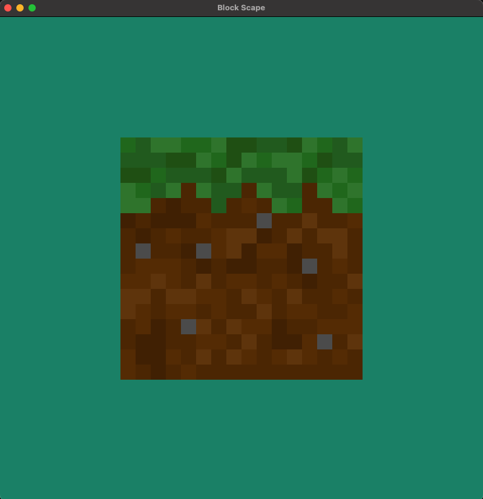
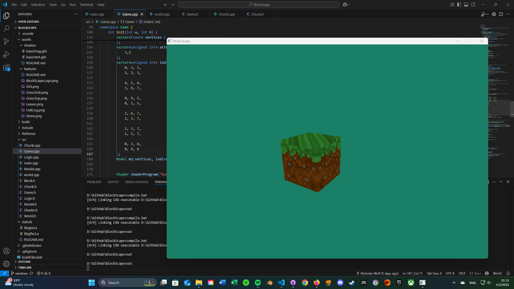
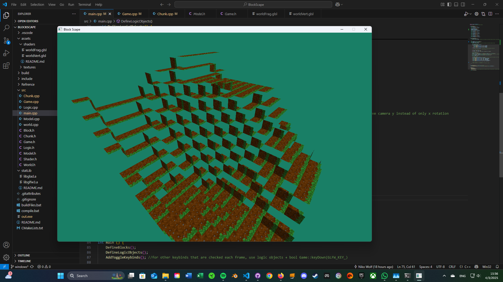
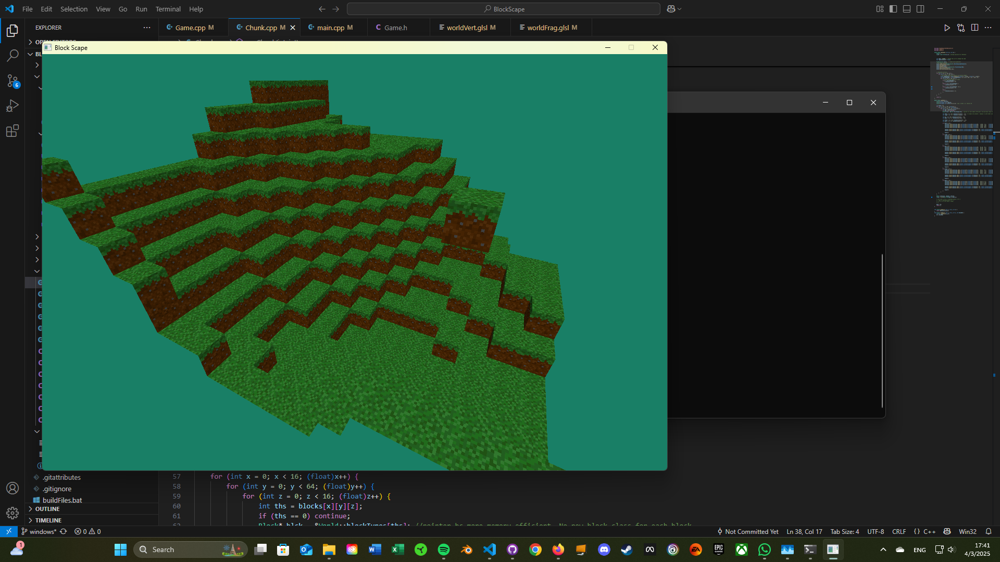
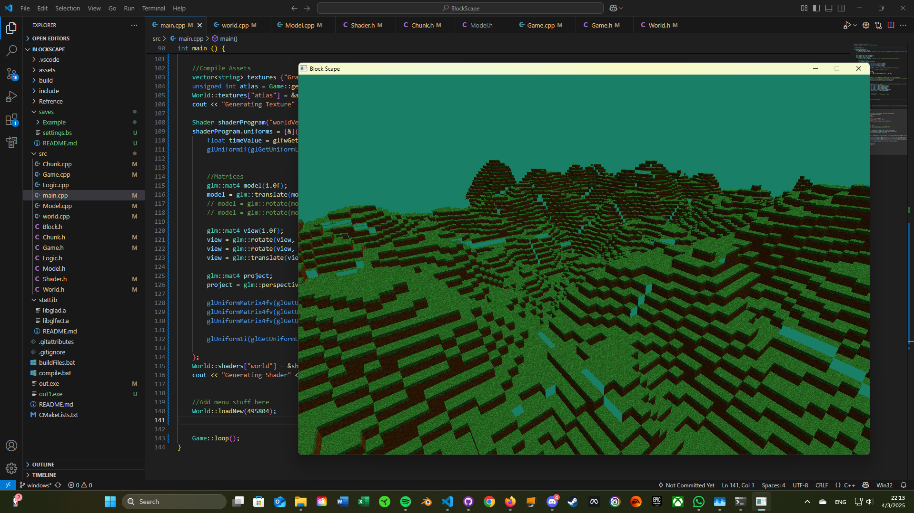
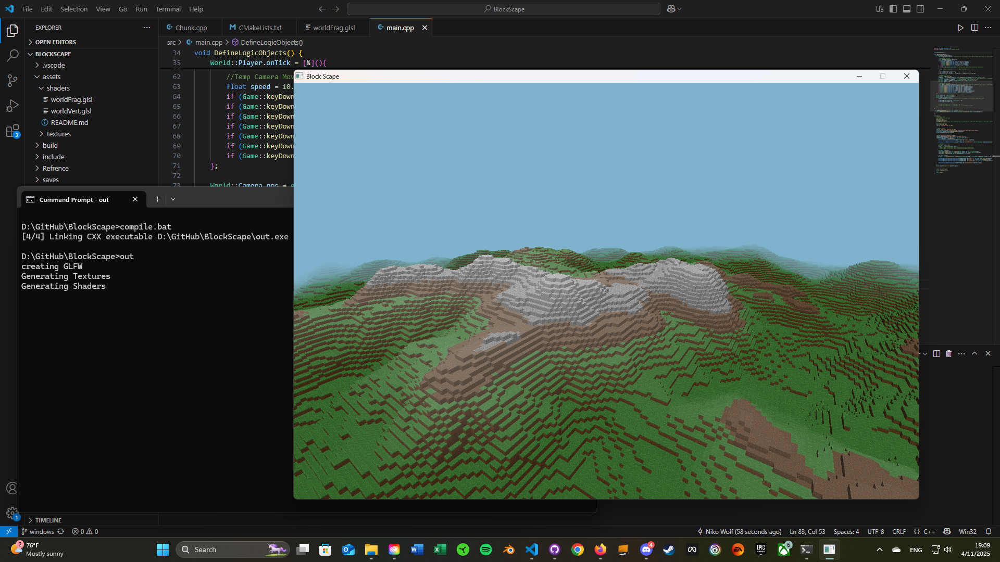

# Blockscape
## Contributors
- Niko: Everything Game Engine Related
- Dallin: Sounds
- Sean: Terrain Gen / Block creation
- Jake: Art and Game Testing
- Ulisses: Player Controller
- David: Art and Game Testing

## To compile yourself
- Install CMake and put into OS's PATH environment variable
- Make sure some version of g++ is installed and usable
- Run "CMake .." inside of ./build, using compiler of your choice, and run the compile command
- Alternatively, run buildFiles.bat or .sh, then compile.bat or .sh
    - If on windows, Ninja will be required to build using the provided batch files.
- Run the file "out.exe" or "out" in the root directory

## Progress Images
### First render:  

### Hardcoded Cube with single texture:  

### First attempt at generating chunk mesh:  

### Chunk with working mesh and multiple textures:  

### Multiple Chunks:  

### Mountains + Snow and Fog in shader:  

### Water Added in Shader:  

## External Links
[Class Diagram Link](https://docs.google.com/drawings/d/1Rja5TI8MIqJgnk-PyeSCaD919eVHrKPN3KJQktHV5DI/edit?usp=sharing)
[Fast Noise Link](https://auburn.github.io/FastNoiseLite/)

